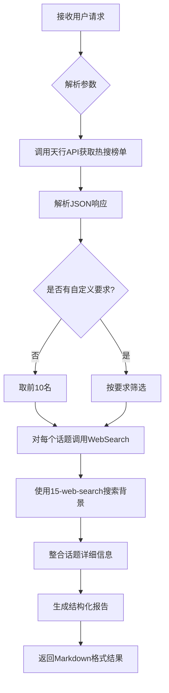

---

name: 14-weibo-trending-G

description: Weibo (Chinese Twitter) trending topics analyzer. Fetches real-time Weibo hot search rankings, enriches each topic with background information, news, and context using 15-web-search skill. Returns top 10 trending topics by default with detailed analysis. Use for Chinese social media trends, hot topics monitoring, public opinion analysis, content marketing insights.

---


# Weibo Trending - 微博热搜分析器


**Version**: 1.0.0

**Category**: Social Media Analytics

**Priority**: P2

**Last Updated**: 2025-12-29


---


## Description


微博热搜分析器自动抓取微博实时热搜榜单，并为每个热搜话题搜索详细的新闻背景和上下文信息。默认返回前10名热搜话题的深度分析，支持自定义数量和筛选条件。


### Core Capabilities


- **实时热搜抓取**: 通过天行API获取微博实时热搜榜单（每30分钟更新）

- **智能话题分析**: 使用15-web-search skill为每个热搜话题搜索背景信息、相关新闻和事件脉络

- **热度指标**: 提供热搜指数、排名、话题分类等多维度数据

- **深度解读**: 自动生成话题摘要、关键信息和事件时间线

- **自定义筛选**: 支持按排名、分类、关键词等条件筛选热搜话题


---


## Instructions


### When to Activate


触发此skill的场景：


1. **热点监控** - 用户想了解当前微博热搜、社会热点

2. **舆情分析** - 需要分析某个话题的热度和讨论方向

3. **内容创作** - 寻找热门话题作为创作素材

4. **趋势研究** - 研究社交媒体趋势和公众关注点

5. **营销策划** - 了解热点话题用于营销活动策划


**触发关键词**:

- "微博热搜"、"微博热点"、"weibo trending"

- "现在微博上什么最火"

- "今天有什么热点"

- "帮我看看微博热搜榜"

- "分析一下当前热搜"


### Execution Flow





---


## TypeScript Interfaces


```typescript

/**

 * Weibo Trending输入配置

 */

interface WeiboTrendingInput {

  /**

   * 返回热搜数量 (默认: 10)

   */

  limit?: number;


  /**

   * 话题分类筛选

   */

  category?: 'all' | 'entertainment' | 'technology' | 'sports' | 'finance' | 'society';


  /**

   * 关键词筛选 (只返回包含该关键词的热搜)

   */

  keyword?: string;


  /**

   * 是否包含详细分析 (默认: true)

   */

  includeAnalysis?: boolean;


  /**

   * 排名范围筛选

   */

  rankRange?: {

    min?: number;  // 最小排名 (例如: 1)

    max?: number;  // 最大排名 (例如: 50)

  };


  /**

   * 自定义输出格式

   */

  outputFormat?: {

    includeSummary?: boolean;      // 包含总结 (默认: true)

    includeTimeline?: boolean;     // 包含时间线 (默认: false)

    includeRelatedTopics?: boolean; // 包含相关话题 (默认: false)

  };

}


/**

 * 单个热搜话题

 */

interface TrendingTopic {

  /**

   * 排名

   */

  rank: number;


  /**

   * 话题标题

   */

  title: string;


  /**

   * 热搜指数

   */

  hotIndex: number;


  /**

   * 话题链接

   */

  url: string;


  /**

   * 话题标签 (热/新/爆/沸等)

   */

  tag?: string;


  /**

   * 话题详细信息 (通过WebSearch获取)

   */

  details?: {

    summary: string;           // 话题摘要

    background: string;        // 背景信息

    keyPoints: string[];       // 关键要点

    sources: string[];         // 信息来源

    relatedNews?: string[];    // 相关新闻

  };

}


/**

 * Weibo Trending输出

 */

interface WeiboTrendingOutput {

  /**

   * 更新时间

   */

  updateTime: string;


  /**

   * 热搜话题列表

   */

  topics: TrendingTopic[];


  /**

   * 总热搜数量

   */

  totalCount: number;


  /**

   * 热搜总结 (可选)

   */

  summary?: {

    topCategories: string[];    // 热门类别

    emergingTopics: string[];   // 新兴话题

    controversialTopics: string[]; // 争议话题

  };


  /**

   * 元数据

   */

  metadata: {

    apiSource: string;

    processingTime: number;

    searchQueriesUsed: number;

  };

}

```


---


## Usage Examples


### Example 1: 获取默认前10名热搜


**用户请求**:

```

今天微博热搜都有什么？

```


**Skill执行**:

1. 调用天行API: `https://apis.tianapi.com/weibohot/index?key=${TIANAPI_KEY}`

2. 解析JSON，获取前10名热搜

3. 对每个话题使用WebSearch搜索背景信息

4. 生成结构化报告


**输出示例**:

```markdown

# 📱 微博实时热搜榜 (更新时间: 2025-12-29 14:30)


## 🔥 Top 10 热搜话题


### 1. 【话题标题】(热搜指数: 4,521,890) 🔥

**背景**: [话题背景信息...]

**关键要点**:

- 要点1

- 要点2

- 要点3


**相关链接**: [微博链接]


---


### 2. 【话题标题】(热搜指数: 3,892,451) 新

...


---


## 📊 热搜总结

- **热门类别**: 娱乐、科技、社会

- **新兴话题**: [...]

```


---


### Example 2: 筛选科技类热搜


**用户请求**:

```

帮我看看微博上有什么科技类的热搜，只要前5个

```


**Skill配置**:

```typescript

{

  limit: 5,

  category: 'technology'

}

```


---


### Example 3: 关键词搜索


**用户请求**:

```

微博热搜里有关于"AI"的话题吗？

```


**Skill配置**:

```typescript

{

  keyword: 'AI',

  includeAnalysis: true

}

```


---


## Implementation Details


### API调用流程


```python

import requests

import json

from datetime import datetime


# 1. 调用天行API获取热搜

def fetch_weibo_trending():

    api_url = "https://apis.tianapi.com/weibohot/index"

    params = {

        "key": "${TIANAPI_KEY}"

    }


    try:

        response = requests.get(api_url, params=params, timeout=10)

        response.raise_for_status()

        data = response.json()


        if data.get('code') == 200:

            return data.get('result', {}).get('list', [])

        else:

            raise Exception(f"API Error: {data.get('msg')}")


    except Exception as e:

        raise Exception(f"Failed to fetch Weibo trending: {str(e)}")


# 2. 解析热搜数据

def parse_trending_topic(item):

    return {

        'rank': item.get('index', 0),

        'title': item.get('word', ''),

        'hotIndex': item.get('hotvalue', 0),

        'url': item.get('url', ''),

        'tag': item.get('tag', '')

    }


# 3. 使用WebSearch搜索话题详情

# Claude会自动调用WebSearch工具

```


### 15-web-search集成策略


对每个热搜话题，调用15-web-search skill：


**搜索模式**: AUTO mode（平衡速度和质量）


**搜索查询构建**:

```bash

cd C:/Users/bigbao/.claude/skills/15-web-search && \

python cli.py "{话题标题} 最新消息 背景 新闻" \

  --mode auto \

  --max-results 10 \

  --time-range week \

  --language zh \

  --output markdown

```


**从搜索结果中提取**:

- 话题起因和背景（从Perplexity AI答案）

- 事件发展时间线（从新闻报道）

- 关键人物和机构（从内容摘要）

- 公众反应和评论（从社交媒体内容）

- 相关新闻链接（从搜索结果URL）


---


## Error Handling


### 常见错误处理


1. **API调用失败**

   - 错误码: `API_ERROR`

   - 处理: 重试3次，失败后返回友好错误信息


2. **API密钥失效**

   - 错误码: `AUTH_ERROR`

   - 处理: 提示用户检查API密钥


3. **网络超时**

   - 错误码: `TIMEOUT_ERROR`

   - 处理: 增加超时时间重试，或返回缓存数据


4. **15-web-search调用失败**

   - 错误码: `SEARCH_ERROR`

   - 处理: 仍返回基本热搜信息，标注"详细信息暂不可用"


5. **数据解析错误**

   - 错误码: `PARSE_ERROR`

   - 处理: 记录错误，跳过该条目继续处理


---


## Best Practices


### 使用建议


1. **合理控制数量**: 默认10条足够，过多会导致搜索耗时过长

2. **缓存机制**: 热搜每30分钟更新，可以缓存结果避免频繁API调用

3. **串行搜索**: 由于15-web-search已经很快（8-12秒），建议串行执行避免并发冲突

4. **关键词提取**: 从话题标题中提取核心关键词进行搜索，提高相关性

5. **时效性**: 使用`--time-range week`参数优先搜索最新（7天内）的新闻和信息

6. **语言过滤**: 使用`--language zh`确保返回中文结果


### 性能优化


- **批量处理**: 一次API调用获取全部热搜，减少请求次数

- **搜索效率**: 15-web-search的AUTO模式约8-12秒完成

- **结果缓存**: 相同话题的搜索结果可缓存1小时

- **超时控制**: 单个话题搜索超时设置为15秒（留足15-web-search执行时间）


---


## Limitations


### 当前限制


1. **数据源限制**: 依赖天行API，受其更新频率（30分钟）和可用性限制

2. **搜索质量**: 依赖15-web-search skill的6个搜索引擎（Exa.ai, Brave, Perplexity等）

3. **语言限制**: 主要支持中文热搜，英文搜索结果可能有限

4. **API配额**: 天行API有免费调用次数限制

5. **实时性**: 非实时数据，有30分钟延迟


### 不支持的功能


- ❌ 实时流式更新（需要WebSocket）

- ❌ 历史热搜趋势对比

- ❌ 话题情感分析（需要额外NLP模型）

- ❌ 用户评论抓取（需要微博登录授权）

- ❌ 话题预测和推荐


---


## Related Skills


- **15-web-search**: 网络搜索引擎（必需依赖，用于话题背景搜索）

- **18-youtube-analyzer**: YouTube分析器（类似的社交媒体分析）

- **36-deep-research**: 深度研究助手（可用于深度挖掘热搜话题）


## Skill Dependencies


**必需依赖**:

- ✅ **15-web-search** - 用于搜索每个热搜话题的详细背景信息

  - 调用方式: Bash工具执行Python CLI

  - 搜索模式: AUTO（平衡速度和质量）

  - 预计耗时: 每个话题8-12秒


**可选依赖**:

- **36-deep-research** - 用于特定话题的深度研究（用户主动要求时）


---


## API Reference


### 天行API - 微博热搜榜


**接口地址**: `https://apis.tianapi.com/weibohot/index`


**请求方式**: GET


**请求参数**:

| 参数 | 类型 | 必填 | 说明 |

|------|------|------|------|

| key  | string | 是 | API密钥 |


**响应格式**:

```json

{

  "code": 200,

  "msg": "success",

  "result": {

    "update_time": "2025-12-29 14:30:00",

    "list": [

      {

        "index": 1,

        "word": "话题标题",

        "hotvalue": "4521890",

        "url": "https://s.weibo.com/weibo?q=话题",

        "tag": "热"

      }

    ]

  }

}

```


**更新频率**: 每30分钟更新一次


**数据来源**: 微博官方热搜榜 (https://s.weibo.com/weibo)


---


### 备用API选项


当主API（天行weibohot接口）不可用时，可以使用以下备用API：


#### 选项1: FreeAPIs.cn 微博热搜API


**接口地址**: `https://api.freeapis.cn/v1/weibo/hot`


**请求方式**: GET


**请求参数**:

| 参数 | 类型 | 必填 | 说明 |

|------|------|------|------|

| KEY  | string | 是 | API密钥（需注册获取） |


**注册地址**: https://www.freeapis.cn/user/key


**配额限制**:

- 免费10,000次/天

- 1次/秒限流


**测试状态**: ⚠️ 需要注册获取KEY


---


#### 选项2: ALAPI 微博热搜


**接口地址**: `https://v2.alapi.cn/api/weibo/hot`


**请求方式**: GET


**请求参数**:

| 参数 | 类型 | 必填 | 说明 |

|------|------|------|------|

| token | string | 是 | API token（需注册获取） |


**注册地址**: https://www.alapi.cn


**配额限制**:

- 10 QPS

- HTTPS加密


**测试状态**: ⚠️ 需要注册获取token


---


**使用建议**:

如果需要更高稳定性和可用性，建议注册上述备用API服务。当主API出现问题时，可以在handler.py中切换到备用API。


---


## Version History


### v1.0.0 (2025-12-29)

- ✅ 初始版本发布

- ✅ 支持天行API热搜抓取

- ✅ 集成WebSearch话题分析

- ✅ 默认Top 10展示

- ✅ 支持自定义筛选和数量


---


## License


MIT License - 详见项目根目录LICENSE文件

