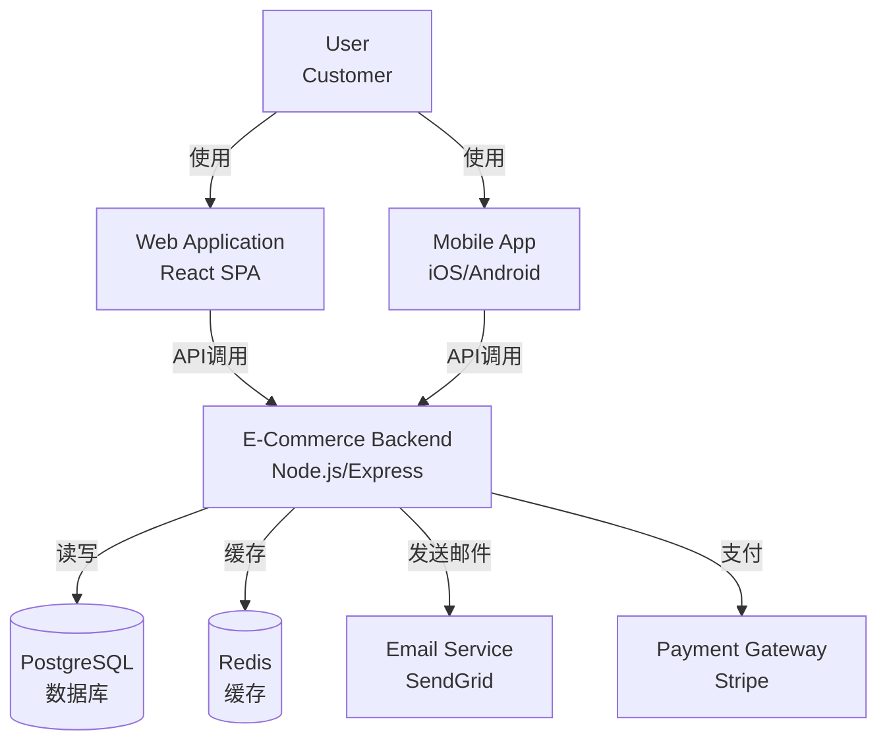
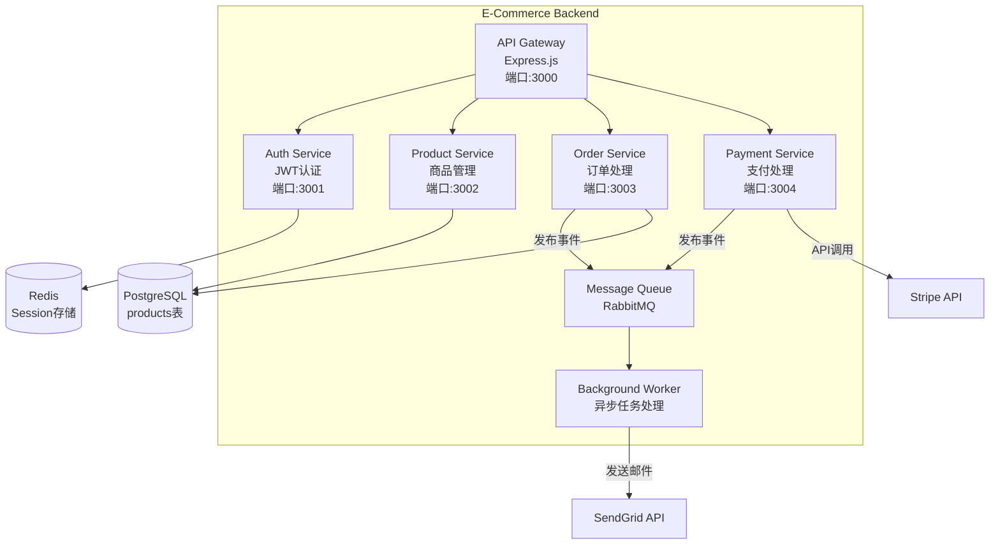

# Knowledge Manager Skill - 智能技术知识管理器

**版本**: 2.0.0
**类型**: 项目管理
**质量等级**: A+

## 📋 功能概述

智能技术文档生成与管理工具,从代码自动生成API文档、架构图、Runbook和知识库。支持文档即代码、全文搜索和多平台同步,提升团队知识共享效率。

### 核心能力

1. **自动文档生成** - OpenAPI/Swagger文档、README自动化、CHANGELOG提取、代码示例
2. **架构图生成** - C4 Model架构图、数据流图(DFD)、ER图、序列图、依赖关系图
3. **知识库构建** - Markdown wiki、全文搜索、标签分类、版本历史、模板管理
4. **Runbook生成** - 故障排查手册、部署步骤、监控playbook、回滚指南
5. **多平台同步** - Notion/Confluence/GitHub Wiki集成、文档CI/CD、多语言翻译

## 🚀 使用方法

### Slash Command
```bash
/manage-knowledge [任务类型]
```

### 自然语言调用
```
生成API文档从代码注释
画出系统架构图
创建部署Runbook
构建知识库搜索
同步文档到Confluence
```

## 📖 使用示例

### 示例:微服务API文档自动生成

**输入**:
```typescript
// src/controllers/UserController.ts

/**
 * @api {get} /users/:id Get User Profile
 * @apiName GetUser
 * @apiGroup User
 *
 * @apiParam {Number} id User's unique ID
 *
 * @apiSuccess {Number} id User ID
 * @apiSuccess {String} email User email
 * @apiSuccess {String} name Full name
 * @apiSuccess {Object} profile User profile details
 * @apiSuccess {String} profile.avatar Avatar URL
 * @apiSuccess {String} profile.bio Biography
 *
 * @apiError UserNotFound The ID was not found
 * @apiError Unauthorized Invalid authentication token
 */
export const getUser = async (req, res) => {
  // implementation
};
```

**输出**:
```markdown
# User Service API Documentation

**Version**: 1.2.0
**Base URL**: https://api.example.com/v1
**Authentication**: Bearer Token

---

## Endpoints

### GET /users/:id

Get user profile by ID.

**Authentication Required**: Yes

**Parameters**:

| Name | Type | Location | Required | Description |
|------|------|----------|----------|-------------|
| id | integer | path | Yes | User's unique ID |

**Request Example**:
```bash
curl -X GET "https://api.example.com/v1/users/123" \
  -H "Authorization: Bearer YOUR_TOKEN"
```

**Response 200 (Success)**:
```json
{
  "id": 123,
  "email": "user@example.com",
  "name": "John Doe",
  "profile": {
    "avatar": "https://cdn.example.com/avatar.jpg",
    "bio": "Software engineer passionate about API design"
  }
}
```

**Error Responses**:

| Status | Code | Message | Description |
|--------|------|---------|-------------|
| 404 | USER_NOT_FOUND | User not found | The specified user ID does not exist |
| 401 | UNAUTHORIZED | Invalid token | Authentication token is missing or invalid |

**Rate Limiting**: 1000 requests/hour per user

---

## Authentication

All API endpoints require Bearer token authentication:

```bash
Authorization: Bearer YOUR_ACCESS_TOKEN
```

Obtain a token via POST /auth/login.

---

## OpenAPI Specification

Download full OpenAPI spec: [openapi.yaml](./openapi.yaml)

```yaml
openapi: 3.0.0
info:
  title: User Service API
  version: 1.2.0
paths:
  /users/{id}:
    get:
      summary: Get user profile
      parameters:
        - name: id
          in: path
          required: true
          schema:
            type: integer
      responses:
        '200':
          description: Success
          content:
            application/json:
              schema:
                $ref: '#/components/schemas/User'
```
```

### 示例:C4架构图生成

**输入**:
```
分析代码库并生成C4 Container架构图
仓库: github.com/company/ecommerce-backend
```

**输出**:
```markdown
# E-Commerce Backend - C4 Container Diagram

## System Context (L1)



## Container Diagram (L2)



## Component Details

| Container | Technology | Responsibility | Scale |
|-----------|------------|----------------|-------|
| API Gateway | Express.js + TypeScript | 路由、认证、限流 | 3 instances |
| Auth Service | Passport.js + JWT | 用户认证、权限管理 | 2 instances |
| Product Service | Express + Prisma ORM | 商品CRUD、搜索 | 4 instances |
| Order Service | Express + Sequelize | 订单管理、状态机 | 4 instances |
| Payment Service | Express + Stripe SDK | 支付处理、退款 | 2 instances |
| Message Queue | RabbitMQ | 异步事件总线 | 1 cluster |
| Background Worker | Bull Queue | 邮件发送、数据同步 | 2 workers |

## Data Flow

### Checkout Flow (结账流程)
1. User → API Gateway → Order Service (创建订单)
2. Order Service → PostgreSQL (保存订单,状态=pending)
3. Order Service → Payment Service (发起支付)
4. Payment Service → Stripe API (处理支付)
5. Payment Service → Message Queue (发布"支付成功"事件)
6. Background Worker → SendGrid (发送确认邮件)
7. Background Worker → Order Service (更新订单状态=completed)

## Security

- **Authentication**: JWT tokens (expires: 24h)
- **Rate Limiting**: 100 req/min per IP
- **Data Encryption**: TLS 1.3 in transit, AES-256 at rest
- **Secret Management**: AWS Secrets Manager
```

### 示例:部署Runbook生成

**输入**:
```
为Order Service创建生产部署Runbook
包含预检查、部署步骤、验证和回滚
```

**输出**:
```markdown
# Order Service Production Deployment Runbook

**Service**: Order Service v2.5.0
**Last Updated**: 2025-12-15
**Owner**: Platform Team

---

## 📋 Pre-Deployment Checklist

- [ ] **Code Review**: 所有PR已审查并合并到main分支
- [ ] **CI/CD Pipeline**: 所有测试通过(单元/集成/E2E)
- [ ] **Database Migration**: 检查是否有pending migrations
- [ ] **Dependencies**: 扫描安全漏洞(npm audit)
- [ ] **Feature Flags**: 确认新功能已配置为disabled
- [ ] **Rollback Plan**: 准备前一版本的镜像tag
- [ ] **On-Call**: 确认部署窗口期有工程师待命
- [ ] **Communication**: 在#deployments Slack频道通知

**Approval Required**: Tech Lead签字

---

## 🚀 Deployment Steps

### Step 1: 通知团队
```bash
# 发送Slack通知
slack-notify "#deployments" "🚀 Starting Order Service v2.5.0 deployment"
```

### Step 2: 数据库迁移 (如果需要)
```bash
# 备份数据库
pg_dump -h prod-db.example.com -U admin orders > backup_$(date +%Y%m%d).sql

# 运行migrations (在一个临时pod中)
kubectl run migration --rm -it \
  --image=orders-service:v2.5.0 \
  --restart=Never \
  -- npm run migrate:up

# 验证schema变更
psql -h prod-db.example.com -U admin orders -c "\d+ orders"
```

**Expected Output**: 新增字段 `payment_method VARCHAR(50)`

### Step 3: 金丝雀部署 (Canary Deployment)

```bash
# 部署到10%流量
kubectl apply -f k8s/canary-deployment.yaml

# 检查Canary pod状态
kubectl get pods -l app=order-service,track=canary

# 等待健康检查通过
kubectl wait --for=condition=ready pod \
  -l app=order-service,track=canary \
  --timeout=120s
```

### Step 4: 流量逐步切换

```bash
# 10% → 50% 流量
kubectl patch svc order-service -p '{"spec":{"selector":{"track":"canary"}}}' --type=merge
kubectl scale deployment order-service-canary --replicas=2

# 等待5分钟,监控错误率
sleep 300

# 检查错误率(应该 < 1%)
curl "https://grafana.example.com/api/error-rate/order-service?window=5m"
```

### Step 5: 全量部署

```bash
# 如果Canary成功,部署到全部pods
kubectl set image deployment/order-service \
  order-service=order-service:v2.5.0

# 等待rolling update完成
kubectl rollout status deployment/order-service --timeout=5m
```

### Step 6: 清理Canary
```bash
kubectl delete deployment order-service-canary
```

---

## ✅ Post-Deployment Verification

### Health Checks
```bash
# 1. Kubernetes健康检查
kubectl get pods -l app=order-service
# 期望: 所有pods处于Running状态

# 2. HTTP健康端点
curl https://api.example.com/health/order-service
# 期望: {"status": "healthy", "version": "2.5.0"}

# 3. 数据库连接
curl https://api.example.com/health/order-service/db
# 期望: {"database": "connected", "latency_ms": 5}
```

### Smoke Tests
```bash
# 创建测试订单
curl -X POST https://api.example.com/v1/orders \
  -H "Authorization: Bearer $TEST_TOKEN" \
  -d '{"items": [{"id": 123, "quantity": 1}]}'

# 期望: 201 Created, 返回订单ID

# 查询订单
curl https://api.example.com/v1/orders/$ORDER_ID \
  -H "Authorization: Bearer $TEST_TOKEN"

# 期望: 200 OK, 包含订单详情
```

### Monitoring
在Grafana中检查以下指标(前30分钟):
- **请求成功率**: > 99.5% ✓
- **P95延迟**: < 200ms ✓
- **错误率**: < 0.5% ✓
- **数据库连接池**: < 80%使用率 ✓

---

## ⚠️ Rollback Procedure

如果发现以下问题,立即回滚:
- 错误率 > 2%
- P95延迟 > 500ms
- 数据库死锁或连接池耗尽
- Critical bug报告

### Fast Rollback (< 2分钟)
```bash
# 回滚到前一版本
kubectl rollout undo deployment/order-service

# 验证回滚完成
kubectl rollout status deployment/order-service

# 通知团队
slack-notify "#deployments" "⚠️ Order Service rolled back to v2.4.9"
```

### Database Rollback (如果有migrations)
```bash
# 运行down migrations
kubectl run migration-rollback --rm -it \
  --image=orders-service:v2.4.9 \
  --restart=Never \
  -- npm run migrate:down
```

---

## 📞 Troubleshooting

### 症状: Pods无法启动
**排查**:
```bash
kubectl describe pod <pod-name>
kubectl logs <pod-name> --previous
```
**常见原因**: 环境变量配置错误、镜像拉取失败

### 症状: 高错误率
**排查**:
```bash
# 检查错误日志
kubectl logs -l app=order-service --tail=100 | grep ERROR

# 检查数据库慢查询
psql -c "SELECT * FROM pg_stat_activity WHERE state = 'active' AND query_start < now() - interval '5 seconds';"
```
**常见原因**: 数据库查询性能问题、第三方API超时

---

## 📊 Metrics Dashboard

监控面板: https://grafana.example.com/d/order-service

关键指标:
- Request Rate (QPS)
- Error Rate (%)
- P50/P95/P99 Latency (ms)
- Database Connections
- Memory Usage (MB)
- CPU Usage (%)

---

**Emergency Contact**: Platform Team Slack: #platform-oncall
```

## 🛠️ 最佳实践

1. **文档即代码**: 将文档存储在Git中,随代码版本演进
2. **自动化生成**: 从代码注释/OpenAPI spec自动生成,减少手动维护
3. **模板复用**: 建立Runbook/ADR模板库,保持一致性
4. **定期更新**: 每次部署后更新Runbook,保持文档时效性
5. **全文搜索**: 使用Algolia/Elasticsearch支持快速搜索

## 🔗 与其他 Skills 配合

- `deployment-orchestrator`: 实际执行部署流程
- `collaboration-hub`: 同步文档到Confluence/Notion
- `code-generator`: 从API文档生成客户端SDK

---

**状态**: ✅ 生产就绪 | **质量等级**: A+
