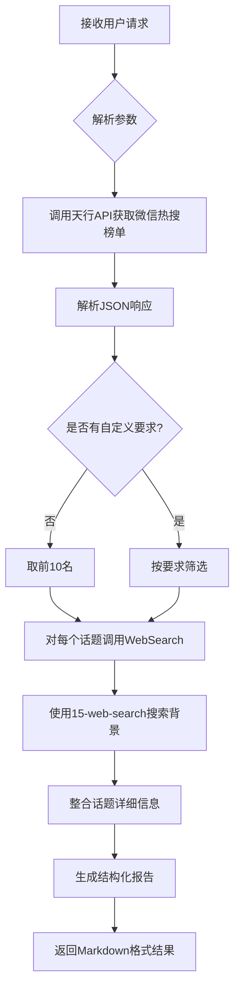

---

name: 30-wechat-trending-G

description: WeChat (Weixin) trending topics analyzer. Fetches real-time WeChat hot search rankings from TianAPI, enriches each topic with background information, news, and context using 15-web-search skill. Returns top 10 trending topics by default with detailed analysis. Use for WeChat ecosystem trends, public account hot topics monitoring, Chinese social media insights.

---


# WeChat Trending - 微信热搜分析器


**Version**: 1.0.0

**Category**: Social Media Analytics

**Priority**: P2

**Last Updated**: 2025-12-29


---


## Description


微信热搜分析器自动抓取微信实时热搜榜单，并为每个热搜话题搜索详细的新闻背景和上下文信息。默认返回前10名热搜话题的深度分析，支持自定义数量和筛选条件。


### Core Capabilities


- **实时热搜抓取**: 通过天行API获取微信实时热搜榜单

- **智能话题分析**: 使用15-web-search skill为每个热搜话题搜索背景信息、相关新闻和事件脉络

- **深度解读**: 自动生成话题摘要、关键信息和事件时间线

- **自定义筛选**: 支持按排名、关键词等条件筛选热搜话题


---


## Instructions


### When to Activate


触发此skill的场景：


1. **热点监控** - 用户想了解当前微信热搜、公众号热点

2. **舆情分析** - 需要分析某个话题在微信生态的热度和传播情况

3. **内容创作** - 寻找热门话题作为公众号创作素材

4. **趋势研究** - 研究微信生态趋势和用户关注点

5. **营销策划** - 了解热点话题用于营销活动策划


**触发关键词**:

- "微信热搜"、"微信热点"、"wechat trending"

- "现在微信上什么最火"

- "今天微信有什么热点"

- "帮我看看微信热搜榜"

- "分析一下微信热搜"


### Execution Flow





---


## TypeScript Interfaces


```typescript

/**

 * WeChat Trending输入配置

 */

interface WeChatTrendingInput {

  /**

   * 返回热搜数量 (默认: 10)

   */

  limit?: number;


  /**

   * 关键词筛选 (只返回包含该关键词的热搜)

   */

  keyword?: string;


  /**

   * 是否包含详细分析 (默认: true)

   */

  includeAnalysis?: boolean;


  /**

   * 排名范围筛选

   */

  rankRange?: {

    min?: number;  // 最小排名

    max?: number;  // 最大排名

  };

}


/**

 * 单个热搜话题

 */

interface TrendingTopic {

  /**

   * 排名

   */

  rank: number;


  /**

   * 话题标题

   */

  title: string;


  /**

   * 话题链接

   */

  url: string;


  /**

   * 话题详细信息 (通过WebSearch获取)

   */

  details?: {

    summary: string;           // 话题摘要

    background: string;        // 背景信息

    keyPoints: string[];       // 关键要点

    sources: string[];         // 信息来源

    relatedArticles?: string[]; // 相关文章

  };

}


/**

 * WeChat Trending输出

 */

interface WeChatTrendingOutput {

  /**

   * 更新时间

   */

  updateTime: string;


  /**

   * 热搜话题列表

   */

  topics: TrendingTopic[];


  /**

   * 总热搜数量

   */

  totalCount: number;


  /**

   * 元数据

   */

  metadata: {

    apiSource: string;

    processingTime: number;

    searchQueriesUsed: number;

  };

}

```


---


## Usage Examples


### Example 1: 获取默认前10名热搜


**用户请求**:

```

今天微信热搜都有什么？

```


**Skill执行**:

1. 调用天行API: `https://apis.tianapi.com/wxhottopic/index?key=...`

2. 解析JSON，获取前10名热搜

3. 对每个话题使用WebSearch搜索背景信息

4. 生成结构化报告


**输出示例**:

```markdown

# 💬 微信热搜榜


更新时间: 2025-12-29 14:30


## 🔥 Top 10 热搜话题


### 1. 【话题标题】


话题概述: [话题详细信息...]

背景信息: [背景...]

关键要点:

- 要点1

- 要点2


🔗 微信搜索: [话题标题](...)

---

```


---


### Example 2: 关键词搜索


**用户请求**:

```

微信热搜里有关于"科技"的话题吗？

```


**Skill配置**:

```typescript

{

  keyword: '科技',

  includeAnalysis: true

}

```


---


## Implementation Details


### API调用流程


```python

import requests

import json

from datetime import datetime


# 1. 调用天行API获取微信热搜

def fetch_wechat_trending():

    api_url = "https://apis.tianapi.com/wxhottopic/index"

    params = {"key": "${TIANAPI_KEY}"}


    try:

        response = requests.get(api_url, params=params, timeout=10, verify=False)

        response.raise_for_status()

        data = response.json()


        if data.get('code') == 200:

            return data.get('result', {}).get('list', [])

        else:

            raise Exception(f"API Error: {data.get('msg')}")


    except Exception as e:

        raise Exception(f"Failed to fetch WeChat trending: {str(e)}")


# 2. 解析热搜数据

def parse_trending_topic(item):

    return {

        'rank': item.get('index', 0) + 1,

        'title': item.get('word', ''),

        'url': f"https://weixin.sogou.com/weixin?type=2&query={item.get('word', '')}"

    }

```


### 15-web-search集成策略


对每个热搜话题，调用15-web-search skill：


**搜索模式**: AUTO mode（平衡速度和质量）


**搜索查询构建**:

```bash

cd C:/Users/bigbao/.claude/skills/15-web-search && \

python cli.py "{话题标题} 最新消息 背景 新闻" \

  --mode auto \

  --max-results 10 \

  --time-range week \

  --language zh \

  --output markdown

```


---


## Error Handling


### 常见错误处理


1. **API调用失败**

   - 错误码: `API_ERROR`

   - 处理: 重试3次，失败后返回友好错误信息


2. **API密钥失效**

   - 错误码: `AUTH_ERROR`

   - 处理: 提示用户检查API密钥


3. **网络超时**

   - 错误码: `TIMEOUT_ERROR`

   - 处理: 增加超时时间重试


4. **15-web-search调用失败**

   - 错误码: `SEARCH_ERROR`

   - 处理: 仍返回基本热搜信息，标注"详细信息暂不可用"


---


## Best Practices


### 使用建议


1. **合理控制数量**: 默认10条足够，过多会导致搜索耗时过长

2. **缓存机制**: 热搜更新频繁，建议5-10分钟缓存

3. **串行搜索**: 由于15-web-search已经很快（8-12秒），建议串行执行避免并发冲突

4. **关键词提取**: 从话题标题中提取核心关键词进行搜索，提高相关性

5. **时效性**: 使用`--time-range week`参数优先搜索最新（7天内）的新闻和信息


---


## Limitations


### 当前限制


1. **数据源限制**: 依赖天行API，受其更新频率和可用性限制

2. **搜索质量**: 依赖15-web-search skill的6个搜索引擎

3. **语言限制**: 主要支持中文热搜

4. **API配额**: 天行API有免费调用次数限制

5. **无热度值**: 微信热搜API不提供热度指数，只有排名


### 不支持的功能


- ❌ 历史热搜趋势对比

- ❌ 话题情感分析（需要额外NLP模型）

- ❌ 公众号内容抓取（需要微信登录授权）

- ❌ 话题预测和推荐


---


## Related Skills


- **15-web-search**: 网络搜索引擎（必需依赖，用于话题背景搜索）

- **14-weibo-trending**: 微博热搜分析器（类似功能，不同平台）

- **21-baidu-trending**: 百度热搜分析器（类似功能，不同平台）

- **28-douyin-trending**: 抖音热搜分析器（类似功能，不同平台）

- **36-deep-research**: 深度研究助手（可用于深度挖掘热搜话题）


## Skill Dependencies


**必需依赖**:

- ✅ **15-web-search** - 用于搜索每个热搜话题的详细背景信息

  - 调用方式: Bash工具执行Python CLI

  - 搜索模式: AUTO（平衡速度和质量）

  - 预计耗时: 每个话题8-12秒


**可选依赖**:

- **36-deep-research** - 用于特定话题的深度研究（用户主动要求时）


---


## API Reference


### 天行API - 微信热搜榜


**接口地址**: `https://apis.tianapi.com/wxhottopic/index`


**请求方式**: GET


**请求参数**:

| 参数 | 类型 | 必填 | 说明 |

|------|------|------|------|

| key  | string | 是 | API密钥 |


**响应格式**:

```json

{

  "code": 200,

  "msg": "success",

  "result": {

    "list": [{

      "word": "话题标题",

      "index": 0

    }]

  }

}

```


**更新频率**: 实时更新


---


### 备用API选项


当主API（天行wxhottopic接口）不可用时，可以使用以下备用API：


#### 选项1: 聚合数据 - 微信热搜榜API


**接口提供商**: 聚合数据 (juhe.cn)


**功能**: 获取微信实时热搜数据


**特点**:

- 稳定可靠的接口服务

- 完善的售后支持

- 需要注册账号获取API密钥


**官方文档**: https://www.juhe.cn/docs/api/id/414


**注册地址**: https://www.juhe.cn


**测试状态**: ⚠️ 需要注册获取API密钥


---


#### 选项2: 综合热榜API


**接口类型**: 聚合多平台热搜（包括微信）


**平台覆盖**:

- 微信热搜榜

- 微信搞笑榜

- 微信财经榜

- 微信八卦榜

- 其他平台：百度、微博、抖音、知乎、B站等


**特点**:

- 一个接口获取多个平台数据

- 免费使用

- 数据更新及时


**参考文档**:

- [免费综合热榜查询API接口](https://zhuanlan.zhihu.com/p/586514283)

- [热搜榜API接口](https://blog.csdn.net/m0_57991918/article/details/132811792)


**测试状态**: ⚠️ 需要查看官方文档获取接口地址


---


#### 选项3: AA1.cn - 微信热搜API


**接口地址**: 参见官方文档


**请求方式**: GET


**响应格式**: JSON


**文档地址**: https://api.aa1.cn/doc/weibo-rs.html


**配额**: 需查看官方文档


**测试状态**: ⚠️ 需要查看官方文档


---


#### 选项4: 天行API - 微信文章精选 ⭐推荐


**接口地址**: `https://apis.tianapi.com/wxnew/index`


**请求方式**: GET


**请求参数**:

| 参数 | 类型 | 必填 | 说明 |

|------|------|------|------|

| key  | string | 是 | API密钥 |


**响应格式**:

```json

{

  "code": 200,

  "msg": "success",

  "result": {

    "curpage": 1,

    "allnum": 10,

    "list": [{

      "id": "文章ID",

      "ctime": "2024-06-14 16:08:53",

      "title": "文章标题",

      "description": "文章描述",

      "picurl": "封面图片URL",

      "url": "文章链接",

      "username": "公众号名称",

      "wxnum": "微信号",

      "author": "作者"

    }]

  }

}

```


**特点**:

- 返回微信精选文章（非热搜榜单）

- 包含文章完整信息（标题、描述、链接、作者等）

- 可作为热点内容的补充数据源

- 天行API官方接口，稳定可靠


**更新频率**: 实时更新


**测试状态**: ✅ 已测试可用（2025-12-29）


**适用场景**:

- 获取微信生态热点文章

- 内容聚合和推荐

- 补充热搜榜单数据


---


**使用建议**:

1. 优先使用天行API wxhottopic接口（已集成，获取热搜榜单）

2. 微信文章精选API（wxnew接口）可作为内容补充，提供热点文章

3. 如需更高稳定性，建议注册聚合数据API作为主备方案

4. 综合热榜API适合需要多平台数据的场景

5. 定期检查备用API的可用性和配额限制


**API对比**:

- wxhottopic：热搜榜单（话题标题+排名）- 当前使用

- wxnew：精选文章（完整文章信息）- 备用补充

- 聚合数据：商业级稳定接口 - 高可用方案

- 综合热榜：多平台聚合 - 跨平台需求


---


## Version History


### v1.0.0 (2025-12-29)

- ✅ 初始版本发布

- ✅ 支持天行API热搜抓取

- ✅ 集成WebSearch话题分析

- ✅ 默认Top 10展示

- ✅ 支持自定义筛选和数量


---


## License


MIT License - 详见项目根目录LICENSE文件

