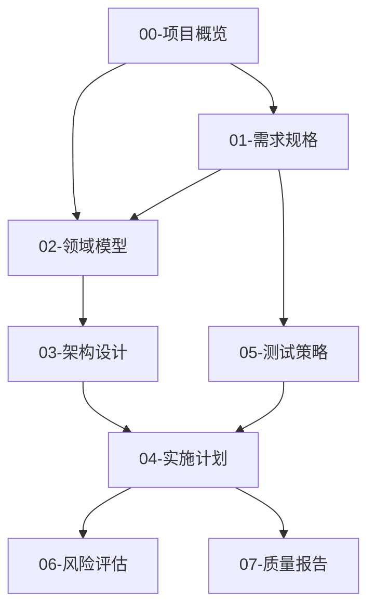

# SpecFlow V2.0 架构设计文档

**版本**: 2.0.0
**设计日期**: 2025-12-14
**设计原则**: 原子级、多文档、专家级
**语言**: 简体中文 🇨🇳

---

## 🎯 设计目标

**核心使命**：为复杂项目自动生成**原子级、多文档、可执行的专家级 spec 文档集**。

### V2.0 突破性改进

| 方面 | V1.0 | V2.0 |
|------|------|------|
| **文档结构** | 单文档（40-60页） | 多文档（8个核心文档） |
| **内容粒度** | 章节级 | **原子级组件** |
| **Token 限制** | 易超过 50k | 每文档 < 15k |
| **驱动模式** | 6种浅整合 | **6种深度融合** |
| **可执行性** | 描述性 | **可直接实施** |
| **专家级别** | 中级 | **专家级** |

---

## 📚 多文档架构设计

### 核心文档集（8个独立文档）

```
项目名称-specs/
├── 00-项目概览.md          (~8,000 token)  - 愿景、背景、利益相关者
├── 01-需求规格.md          (~12,000 token) - 原子级功能需求、用户故事
├── 02-领域模型.md          (~10,000 token) - DDD 领域建模、限界上下文
├── 03-架构设计.md          (~12,000 token) - 技术架构、API 契约、ADR
├── 04-实施计划.md          (~10,000 token) - WBS、估算、里程碑
├── 05-测试策略.md          (~12,000 token) - BDD 场景、测试金字塔
├── 06-风险评估.md          (~8,000 token)  - 风险矩阵、缓解措施
└── 07-质量报告.md          (~8,000 token)  - 质量评分、改进建议
```

**总计**: ~80,000 token，分散在 8 个文档中，每个文档安全在 token 限制内。

### 文档依赖关系



---

## 🧩 原子级组件模型

### 原子组件 Schema（基于原子级.txt）

每个功能需求、UI 组件、API 端点都遵循**原子组件模板**：

```python
@dataclass
class AtomicComponent:
    """原子级组件（可直接实施）"""
    # 1. 基础信息（自文档化）
    id: str                          # 唯一标识：USER-AUTH-001
    name: str                        # 自文档化名称：UserLoginForm
    category: str                    # 分类：UI Component / API / Service / Data Model

    # 2. 目标与用途（一句话清晰描述）
    purpose: str                     # "允许用户通过邮箱和密码登录系统"
    context: Dict[str, Any]          # {"domain": "用户管理", "tech": ["React", "JWT"]}

    # 3. 原子级属性定义
    props: List[AtomicProperty]      # 属性列表（每个都是原子级）
    ui_spec: Optional[UISpec]        # UI 规格（布局、样式、状态）
    api_contract: Optional[APIContract]  # API 契约（入参、出参、错误码）
    data_model: Optional[DataModel]  # 数据模型（字段、类型、约束）

    # 4. 交互与行为（事件驱动）
    interactions: List[Interaction]  # [{"event": "submit", "result": "调用 /api/login"}]
    business_rules: List[str]        # 业务规则列表

    # 5. 依赖与约束
    dependencies: List[str]          # 依赖的其他组件：["AuthService", "TokenStore"]
    constraints: List[str]           # 约束：["响应时间 < 200ms", "符合 WCAG 2.1"]

    # 6. 边界与错误处理
    edge_cases: List[EdgeCase]       # 边界情况：网络错误、无效输入
    error_handling: ErrorHandling    # 错误处理策略

    # 7. 验收标准（可测试）
    acceptance_criteria: List[str]   # ["用户输入有效凭据后能成功登录"]
    bdd_scenarios: List[BDDScenario] # Given-When-Then 场景
    test_cases: List[TestCase]       # 单元测试、集成测试用例

    # 8. 元数据
    priority: str                    # Critical / High / Medium / Low
    estimated_hours: float           # 工作量估算（PERT 三点估算）
    assigned_phase: str              # MVP / Phase 1 / Phase 2
```

### 原子属性定义

```python
@dataclass
class AtomicProperty:
    """原子级属性（不可再分）"""
    name: str                    # 属性名：email
    type: str                    # 类型：string / number / boolean / object
    required: bool               # 是否必填
    default: Optional[Any]       # 默认值
    validation: List[str]        # 验证规则：["email format", "max 100 chars"]
    description: str             # 描述："用户登录邮箱地址"
```

---

## 🔬 6种驱动模式深度整合

### 1. TDD (测试驱动开发) - 测试优先

**提取精华**：
- ✅ **Red-Green-Refactor 循环**：先写测试，后写实现
- ✅ **可测试性设计**：每个组件都有明确的测试用例
- ✅ **快速反馈**：测试即文档

**应用到 Spec**：
```markdown
## 组件：UserLoginForm

### 测试用例（TDD）
1. **测试 1**：用户输入有效邮箱和密码 → 成功登录
   - Given: 用户在登录页面
   - When: 输入 "user@example.com" 和 "ValidPass123"
   - Then: 调用 POST /api/login，返回 JWT token

2. **测试 2**：用户输入无效邮箱 → 显示错误
   - Given: 用户在登录页面
   - When: 输入 "invalid-email" 和任意密码
   - Then: 显示 "请输入有效的邮箱地址"

### 实现规格（基于测试）
- 邮箱验证：使用正则表达式 `^[^\s@]+@[^\s@]+\.[^\s@]+$`
- 密码长度：最少 8 个字符
- 错误显示：红色文字，字段下方，16px
```

### 2. BDD (行为驱动开发) - 场景驱动

**提取精华**：
- ✅ **Given-When-Then 格式**：清晰的行为描述
- ✅ **业务语言**：非技术人员可读
- ✅ **活文档**：规格即测试脚本

**应用到 Spec**：
```gherkin
Feature: 用户登录
  作为一个注册用户
  我想要登录系统
  以便访问我的个人数据

Scenario: 成功登录
  Given 用户已注册，邮箱为 "user@example.com"
  And 密码为 "ValidPass123"
  When 用户访问登录页面
  And 输入邮箱 "user@example.com"
  And 输入密码 "ValidPass123"
  And 点击"登录"按钮
  Then 系统验证凭据
  And 生成 JWT token
  And 重定向到 "/dashboard"
  And 显示欢迎消息 "欢迎回来，[用户名]"

Scenario: 邮箱格式错误
  Given 用户在登录页面
  When 输入邮箱 "invalid-email"
  And 输入密码 "anypassword"
  And 点击"登录"按钮
  Then 显示错误 "请输入有效的邮箱地址"
  And 登录按钮保持可用
```

### 3. DDD (领域驱动设计) - 领域建模

**提取精华**：
- ✅ **限界上下文**：明确领域边界
- ✅ **聚合根**：领域模型的入口
- ✅ **领域事件**：业务事件驱动
- ✅ **通用语言**：团队统一术语

**应用到 Spec**：
```markdown
## 限界上下文：用户管理 (User Management)

### 聚合根：User
- **聚合根 ID**: userId (UUID)
- **实体**: User, UserProfile, UserPreferences
- **值对象**: Email, Password, UserRole

### 领域模型

#### 实体：User
```typescript
class User {
  userId: UUID              // 聚合根 ID
  email: Email              // 值对象
  passwordHash: string      // 加密后的密码
  profile: UserProfile      // 关联实体
  preferences: UserPreferences
  roles: UserRole[]         // 值对象列表
  createdAt: DateTime
  lastLoginAt: DateTime

  // 领域行为
  login(password: Password): Result<JWT, AuthError>
  logout(): void
  updateProfile(profile: UserProfile): Result<void, ValidationError>
}
```

### 领域事件
- `UserRegistered`: 用户注册成功
- `UserLoggedIn`: 用户登录成功
- `UserLoggedOut`: 用户登出
- `ProfileUpdated`: 用户资料更新

### 通用语言
- **用户 (User)**: 系统注册用户
- **凭据 (Credentials)**: 邮箱 + 密码
- **认证 (Authentication)**: 验证用户身份
- **授权 (Authorization)**: 验证用户权限
```

### 4. ATDD (验收测试驱动) - 验收标准

**提取精华**：
- ✅ **验收标准前置**：开发前明确成功标准
- ✅ **客户语言**：用客户的话描述需求
- ✅ **自动化验收测试**：可执行的验收标准

**应用到 Spec**：
```markdown
## 用户故事：用户登录

**作为** 注册用户
**我想要** 通过邮箱和密码登录
**以便** 访问我的个人数据

### 验收标准（ATDD）

#### AC 1: 成功登录
- ✅ 用户输入有效邮箱和密码
- ✅ 系统验证凭据正确
- ✅ 系统生成 JWT token（有效期 24 小时）
- ✅ 系统重定向到 /dashboard
- ✅ 系统显示欢迎消息
- ✅ 系统记录登录时间到 lastLoginAt

#### AC 2: 错误处理
- ✅ 邮箱格式错误 → 显示 "请输入有效的邮箱地址"
- ✅ 密码错误 → 显示 "邮箱或密码错误"（不透露哪个错误）
- ✅ 网络错误 → 显示 "连接失败，请重试"
- ✅ 账户锁定 → 显示 "账户已锁定，请联系管理员"

#### AC 3: 性能要求
- ✅ 登录响应时间 < 500ms（P95）
- ✅ 支持并发 1000 个请求/秒

#### 自动化验收测试（示例）
```typescript
describe('用户登录验收测试', () => {
  test('AC 1: 成功登录', async () => {
    // 步骤 1: 访问登录页面
    await page.goto('/login');

    // 步骤 2: 输入有效凭据
    await page.fill('[name="email"]', 'user@example.com');
    await page.fill('[name="password"]', 'ValidPass123');

    // 步骤 3: 点击登录
    await page.click('button[type="submit"]');

    // 验收标准验证
    await expect(page).toHaveURL('/dashboard');
    await expect(page.locator('.welcome-message')).toContainText('欢迎回来');

    // 验证 token 存在
    const token = await page.evaluate(() => localStorage.getItem('authToken'));
    expect(token).toBeTruthy();
  });
});
```
```

### 5. FDD (特性驱动开发) - 特性分解

**提取精华**：
- ✅ **特性列表**：按价值优先级排序
- ✅ **小而频繁的交付**：每个特性 2-10 天完成
- ✅ **领域对象建模**：特性与领域模型结合

**应用到 Spec**：
```markdown
## 特性分解（FDD）

### 主特性：用户认证与授权
估算：40 小时（5 天，2 名开发者）

#### 子特性列表（按优先级）

1. **特性 1.1**: 用户登录（核心）
   - **价值**: Critical
   - **复杂度**: Medium
   - **估算**: 8 小时
   - **依赖**: 数据库 User 表
   - **验收**: 用户能够登录并获取 token

2. **特性 1.2**: 用户登出
   - **价值**: High
   - **复杂度**: Low
   - **估算**: 2 小时
   - **依赖**: 特性 1.1
   - **验收**: 用户能够登出并清除 token

3. **特性 1.3**: 记住我功能
   - **价值**: Medium
   - **复杂度**: Medium
   - **估算**: 4 小时
   - **依赖**: 特性 1.1
   - **验收**: 用户选择"记住我"后 30 天内自动登录

4. **特性 1.4**: 密码重置
   - **价值**: High
   - **复杂度**: High
   - **估算**: 12 小时
   - **依赖**: 邮件服务
   - **验收**: 用户能通过邮箱重置密码

5. **特性 1.5**: 多因素认证（MFA）
   - **价值**: High（安全）
   - **复杂度**: High
   - **估算**: 16 小时
   - **依赖**: 特性 1.1, SMS 服务
   - **验收**: 用户能启用 MFA 并通过验证码登录

### 特性开发顺序
```
迭代 1（1周）: 1.1 → 1.2 → 1.3
迭代 2（1周）: 1.4 → 1.5
```
```

### 6. SDD (规格驱动开发) - 规格优先

**提取精华**：
- ✅ **规格即代码**：可执行的规格
- ✅ **契约优先**：API 契约、接口定义优先
- ✅ **类型安全**：强类型规格定义

**应用到 Spec**：
```markdown
## API 规格（SDD - 可执行的契约）

### API 契约：POST /api/login

#### OpenAPI 规格（可直接生成代码）
```yaml
openapi: 3.0.0
paths:
  /api/login:
    post:
      summary: 用户登录
      operationId: userLogin
      requestBody:
        required: true
        content:
          application/json:
            schema:
              type: object
              required:
                - email
                - password
              properties:
                email:
                  type: string
                  format: email
                  example: "user@example.com"
                password:
                  type: string
                  minLength: 8
                  example: "ValidPass123"
                rememberMe:
                  type: boolean
                  default: false
      responses:
        '200':
          description: 登录成功
          content:
            application/json:
              schema:
                type: object
                properties:
                  token:
                    type: string
                    description: JWT token
                  expiresAt:
                    type: string
                    format: date-time
                  user:
                    $ref: '#/components/schemas/User'
        '400':
          description: 请求参数错误
          content:
            application/json:
              schema:
                $ref: '#/components/schemas/Error'
        '401':
          description: 凭据错误
        '429':
          description: 请求过于频繁
```

#### TypeScript 接口定义（从 OpenAPI 生成）
```typescript
// 自动生成的类型定义
interface LoginRequest {
  email: string;        // 邮箱格式验证
  password: string;     // 最少 8 个字符
  rememberMe?: boolean; // 可选，默认 false
}

interface LoginResponse {
  token: string;        // JWT token
  expiresAt: Date;      // token 过期时间
  user: User;           // 用户信息
}

interface LoginError {
  code: string;         // 错误代码
  message: string;      // 用户可读的错误消息
  details?: any;        // 详细错误信息
}

// API 函数签名
async function login(
  request: LoginRequest
): Promise<Result<LoginResponse, LoginError>>;
```

#### 契约测试（验证规格）
```typescript
import { validateAgainstSchema } from 'openapi-validator';

test('登录 API 符合 OpenAPI 规格', async () => {
  const response = await api.post('/api/login', {
    email: 'user@example.com',
    password: 'ValidPass123'
  });

  // 验证响应符合 OpenAPI schema
  expect(validateAgainstSchema(response, 'LoginResponse')).toBe(true);
});
```
```

---

## 🎨 文档生成流程

### 自动化生成流程

```
用户输入任务描述
        ↓
1. 任务分析 & 复杂度评估
   - 估算工作量（小时）
   - 识别领域和技术栈
   - 确定深度级别
        ↓
2. 文档集规划
   - 确定需要生成哪些文档
   - 简单项目：3-4个文档
   - 中等项目：5-6个文档
   - 复杂项目：8个完整文档
        ↓
3. 原子级组件提取
   - 识别功能需求 → 原子组件
   - 识别 UI 组件 → UI 原子规格
   - 识别 API 端点 → API 契约
   - 识别数据模型 → DDD 实体
        ↓
4. 逐文档生成（顺序）
   00-项目概览 → 01-需求规格 → 02-领域模型
   → 03-架构设计 → 04-实施计划 → 05-测试策略
   → 06-风险评估 → 07-质量报告
        ↓
5. 质量验证
   - 原子性检查：每个组件是否足够细粒度
   - 完整性检查：是否覆盖所有需求
   - 一致性检查：术语、接口是否一致
   - Token 限制检查：每个文档 < 15k token
        ↓
6. 生成文档集
   - 保存到 {项目名}-specs/ 目录
   - 生成索引文档 README.md
   - 生成文档间链接
```

---

## 🏗️ 技术实现架构

### 核心模块

```python
# 1. 分析器模块
class TaskAnalyzer:
    """任务分析器：分析任务复杂度，确定生成策略"""
    def analyze(self, task_description: str) -> AnalysisResult
    def estimate_complexity(self) -> ComplexityLevel
    def identify_domains(self) -> List[str]
    def suggest_documents(self) -> List[str]

# 2. 原子级提取器
class AtomicExtractor:
    """原子级组件提取器：从需求中提取原子组件"""
    def extract_components(self, requirements: str) -> List[AtomicComponent]
    def extract_ui_specs(self, ui_description: str) -> List[UISpec]
    def extract_api_contracts(self, api_description: str) -> List[APIContract]

# 3. 多文档生成器
class MultiDocGenerator:
    """多文档生成器：生成文档集"""
    def generate_overview(self, context: ProjectContext) -> str
    def generate_requirements(self, components: List[AtomicComponent]) -> str
    def generate_domain_model(self, entities: List[Entity]) -> str
    def generate_architecture(self, design: ArchitectureDesign) -> str
    def generate_implementation_plan(self, tasks: List[Task]) -> str
    def generate_test_strategy(self, scenarios: List[BDDScenario]) -> str
    def generate_risk_assessment(self, risks: List[Risk]) -> str
    def generate_quality_report(self, metrics: QualityMetrics) -> str

# 4. 质量验证器
class QualityValidator:
    """质量验证器：验证文档质量"""
    def check_atomicity(self, components: List[AtomicComponent]) -> bool
    def check_completeness(self, documents: List[Document]) -> float
    def check_consistency(self, documents: List[Document]) -> float
    def check_token_limits(self, document: str) -> bool
```

---

## 📊 配置系统 V2.0

### 文档生成配置

```python
DOCUMENT_CONFIGS = {
    "simple": {
        "documents": [
            "00-项目概览",
            "01-需求规格",
            "03-架构设计",
            "05-测试策略"
        ],
        "max_token_per_doc": 10000,
        "detail_level": "high_level",
        "total_pages_target": 15
    },
    "standard": {
        "documents": [
            "00-项目概览",
            "01-需求规格",
            "02-领域模型",
            "03-架构设计",
            "04-实施计划",
            "05-测试策略"
        ],
        "max_token_per_doc": 12000,
        "detail_level": "detailed",
        "total_pages_target": 30
    },
    "comprehensive": {
        "documents": [
            "00-项目概览",
            "01-需求规格",
            "02-领域模型",
            "03-架构设计",
            "04-实施计划",
            "05-测试策略",
            "06-风险评估",
            "07-质量报告"
        ],
        "max_token_per_doc": 15000,
        "detail_level": "comprehensive",
        "total_pages_target": 60
    }
}
```

---

## ✅ 成功指标

### V2.0 质量目标

| 指标 | 目标 | 验证方法 |
|------|------|---------|
| **原子性** | 100% 组件可直接实施 | 人工审查 + 自动化检查 |
| **完整性** | ≥ 95% 需求覆盖 | 完整性评分算法 |
| **一致性** | 100% 术语统一 | 术语表自动检查 |
| **可执行性** | 100% BDD 场景可执行 | Gherkin 语法验证 |
| **Token 安全** | 每文档 < 15k token | 自动化 token 计数 |
| **专家级别** | A+ 评分 | 质量评分系统 |

---

**创建日期**: 2025-12-14
**维护者**: Claude Code
**状态**: 🚧 设计中 → 即将实施
**语言**: 简体中文 🇨🇳
