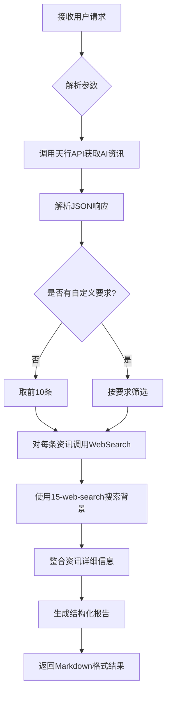

---

name: 49-ai-news-G

description: AI news analyzer. Fetches real-time AI news and updates from TianAPI, enriches each article with background information and analysis using 15-web-search skill. Returns top 10 AI news by default with detailed insights. Use for AI industry trends monitoring, tech news tracking, AI research updates, machine learning news aggregation.

---


# AI News - AI资讯分析器


**Version**: 1.0.0

**Category**: AI News Analytics

**Priority**: P2

**Last Updated**: 2025-12-29


---


## Description


AI资讯分析器自动抓取AI领域实时资讯，并为每条资讯搜索详细的背景信息和深度解读。默认返回前10条最新AI资讯的深度分析，支持自定义数量和筛选条件。


### Core Capabilities


- **实时资讯抓取**: 通过天行API获取AI领域最新资讯

- **智能内容分析**: 使用15-web-search skill为每条资讯搜索背景信息、相关新闻和深度解读

- **深度洞察**: 自动生成资讯摘要、关键要点和技术分析

- **自定义筛选**: 支持按数量、关键词等条件筛选AI资讯


---


## Instructions


### When to Activate


触发此skill的场景：


1. **AI行业动态** - 用户想了解最新的AI行业新闻和技术进展

2. **技术趋势分析** - 需要分析AI领域的热点话题和技术趋势

3. **研究跟踪** - 追踪AI研究领域的最新突破和成果

4. **竞品监控** - 了解AI领域主要公司和产品的最新动态

5. **内容创作** - 寻找AI相关话题作为技术博客创作素材


**触发关键词**:

- "AI资讯"、"AI新闻"、"ai news"

- "最新的AI动态"

- "今天AI领域有什么新闻"

- "帮我看看AI行业热点"

- "分析一下最新的AI资讯"


### Execution Flow





---


## TypeScript Interfaces


```typescript

/**

 * AI News输入配置

 */

interface AINewsInput {

  /**

   * 返回资讯数量 (默认: 10)

   */

  limit?: number;


  /**

   * 关键词筛选 (只返回包含该关键词的资讯)

   */

  keyword?: string;


  /**

   * 是否包含详细分析 (默认: true)

   */

  includeAnalysis?: boolean;

}


/**

 * 单条AI资讯

 */

interface AINewsItem {

  /**

   * 排名

   */

  rank: number;


  /**

   * 资讯标题

   */

  title: string;


  /**

   * 资讯描述

   */

  description: string;


  /**

   * 来源

   */

  source: string;


  /**

   * 原文链接

   */

  url: string;


  /**

   * 发布时间

   */

  publishTime: string;


  /**

   * 封面图片URL

   */

  picUrl?: string;


  /**

   * 资讯详细信息 (通过WebSearch获取)

   */

  details?: {

    summary: string;           // 深度解读

    background: string;        // 背景信息

    keyPoints: string[];       // 关键要点

    sources: string[];         // 信息来源

    relatedArticles?: string[]; // 相关文章

  };

}


/**

 * AI News输出

 */

interface AINewsOutput {

  /**

   * 更新时间

   */

  updateTime: string;


  /**

   * AI资讯列表

   */

  newsItems: AINewsItem[];


  /**

   * 总资讯数量

   */

  totalCount: number;


  /**

   * 元数据

   */

  metadata: {

    apiSource: string;

    processingTime: number;

    searchQueriesUsed: number;

  };

}

```


---


## Usage Examples


### Example 1: 获取默认前10条AI资讯


**用户请求**:

```

今天AI领域有什么新闻？

```


**Skill执行**:

1. 调用天行API: `https://apis.tianapi.com/ai/index?key=...`

2. 解析JSON，获取前10条AI资讯

3. 对每条资讯使用WebSearch搜索背景信息

4. 生成结构化报告


**输出示例**:

```markdown

# 🤖 AI资讯速递


更新时间: 2025-12-29 14:30


## 📰 Top 10 AI资讯


### 1. 【资讯标题】


📅 发布时间: 2025-12-29 00:00

📌 来源: IT家人工智能


📝 内容概述: [资讯描述...]

💡 深度解读: [背景信息...]

🔑 关键要点:

- 要点1

- 要点2


🔗 原文链接: [链接]

---

```


---


### Example 2: 关键词搜索


**用户请求**:

```

AI资讯里有关于"谷歌"的吗？

```


**Skill配置**:

```typescript

{

  keyword: '谷歌',

  includeAnalysis: true

}

```


---


## Implementation Details


### API调用流程


```python

import requests

import json

from datetime import datetime


# 1. 调用天行API获取AI资讯

def fetch_ai_news():

    api_url = "https://apis.tianapi.com/ai/index"

    params = {"key": "${TIANAPI_KEY}"}


    try:

        response = requests.get(api_url, params=params, timeout=10, verify=False)

        response.raise_for_status()

        data = response.json()


        if data.get('code') == 200:

            return data.get('result', {}).get('newslist', [])

        else:

            raise Exception(f"API Error: {data.get('msg')}")


    except Exception as e:

        raise Exception(f"Failed to fetch AI news: {str(e)}")


# 2. 解析AI资讯数据

def parse_news_item(item, index):

    return {

        'rank': index + 1,

        'title': item.get('title', ''),

        'description': item.get('description', ''),

        'source': item.get('source', ''),

        'url': item.get('url', ''),

        'publish_time': item.get('ctime', ''),

        'pic_url': item.get('picUrl', ''),

        'news_id': item.get('id', '')

    }

```


### 15-web-search集成策略


对每条AI资讯，调用15-web-search skill：


**搜索模式**: AUTO mode（平衡速度和质量）


**搜索查询构建**:

```bash

cd C:/Users/bigbao/.claude/skills/15-web-search && \

python cli.py "{资讯标题} 详细 分析" \

  --mode auto \

  --max-results 10 \

  --time-range week \

  --language zh \

  --output markdown

```


---


## Error Handling


### 常见错误处理


1. **API调用失败**

   - 错误码: `API_ERROR`

   - 处理: 重试3次，失败后返回友好错误信息


2. **API密钥失效**

   - 错误码: `AUTH_ERROR`

   - 处理: 提示用户检查API密钥


3. **网络超时**

   - 错误码: `TIMEOUT_ERROR`

   - 处理: 增加超时时间重试


4. **15-web-search调用失败**

   - 错误码: `SEARCH_ERROR`

   - 处理: 仍返回基本资讯信息，标注"详细信息暂不可用"


---


## Best Practices


### 使用建议


1. **合理控制数量**: 默认10条足够，过多会导致搜索耗时过长

2. **缓存机制**: AI资讯更新频繁，建议每小时更新一次

3. **串行搜索**: 由于15-web-search已经很快（8-12秒），建议串行执行避免并发冲突

4. **关键词提取**: 从资讯标题中提取核心关键词进行搜索，提高相关性

5. **时效性**: 使用`--time-range week`参数优先搜索最新（7天内）的新闻和信息


---


## Limitations


### 当前限制


1. **数据源限制**: 依赖天行API，受其更新频率和可用性限制

2. **搜索质量**: 依赖15-web-search skill的6个搜索引擎

3. **语言限制**: 主要支持中文AI资讯

4. **API配额**: 天行API有免费调用次数限制

5. **内容深度**: 基于API提供的摘要，详细内容需访问原文


### 不支持的功能


- ❌ 历史资讯趋势对比

- ❌ 资讯情感分析（需要额外NLP模型）

- ❌ 全文内容抓取（需要网页爬虫）

- ❌ 资讯智能推荐


---


## Related Skills


- **15-web-search**: 网络搜索引擎（必需依赖，用于资讯背景搜索）

- **14-weibo-trending**: 微博热搜分析器（社交媒体热点）

- **21-baidu-trending**: 百度热搜分析器（搜索引擎热点）

- **28-douyin-trending**: 抖音热搜分析器（短视频平台热点）

- **30-wechat-trending**: 微信热搜分析器（微信生态热点）

- **36-deep-research**: 深度研究助手（可用于深度挖掘AI资讯话题）


## Skill Dependencies


**必需依赖**:

- ✅ **15-web-search** - 用于搜索每条AI资讯的详细背景信息

  - 调用方式: Bash工具执行Python CLI

  - 搜索模式: AUTO（平衡速度和质量）

  - 预计耗时: 每条资讯8-12秒


**可选依赖**:

- **36-deep-research** - 用于特定AI话题的深度研究（用户主动要求时）


---


## API Reference


### 天行API - AI资讯


**接口地址**: `https://apis.tianapi.com/ai/index`


**请求方式**: GET


**请求参数**:

| 参数 | 类型 | 必填 | 说明 |

|------|------|------|------|

| key  | string | 是 | API密钥 |


**响应格式**:

```json

{

  "code": 200,

  "msg": "success",

  "result": {

    "curpage": 1,

    "allnum": 10,

    "newslist": [{

      "id": "资讯ID",

      "ctime": "2025-12-29 00:00",

      "title": "资讯标题",

      "description": "资讯描述",

      "source": "来源",

      "picUrl": "封面图片URL",

      "url": "原文链接"

    }]

  }

}

```


**更新频率**: 实时更新


---


### 备用API选项


当主API（天行ai接口）不可用时，可以使用以下备用API：


#### 选项1: 聚合数据 - AI资讯API


**接口提供商**: 聚合数据 (juhe.cn)


**功能**: 获取AI行业资讯


**特点**:

- 稳定可靠的接口服务

- 完善的售后支持

- 需要注册账号获取API密钥


**官方网站**: https://www.juhe.cn


**测试状态**: ⚠️ 需要注册获取API密钥


---


#### 选项2: NewsAPI - 全球科技新闻


**接口类型**: 全球新闻聚合（可筛选AI相关）


**功能覆盖**:

- 支持关键词筛选（AI, machine learning等）

- 支持多语言和时间范围筛选

- 提供新闻来源筛选


**特点**:

- 全球主流媒体覆盖

- 免费版每日100次调用

- 数据更新及时


**官方网站**: https://newsapi.org


**测试状态**: ⚠️ 需要注册获取API密钥


---


#### 选项3: 36氪API - 中国科技新闻


**接口类型**: 中国科技创投新闻


**覆盖内容**:

- AI创业公司动态

- 融资信息

- 技术趋势分析

- 行业报告


**特点**:

- 聚焦中国科技创投领域

- 内容深度较高

- 更新及时


**测试状态**: ⚠️ 需要查看官方文档


---


#### 选项4: AI新闻聚合RSS源 ⭐推荐


**数据源**: 多个AI领域主流媒体RSS


**推荐RSS源**:

- MIT Technology Review (AI板块)

- VentureBeat AI

- The Verge AI

- 量子位

- 机器之心

- AI科技评论


**特点**:

- 免费使用

- 内容权威

- 可通过RSS解析库处理


**实现方式**: 使用Python的feedparser库解析RSS源


**测试状态**: ✅ 可用


---


**使用建议**:

1. 优先使用天行API ai接口（已集成，获取AI行业综合资讯）

2. NewsAPI适合需要全球AI新闻的场景

3. 如需更高稳定性，建议注册聚合数据API作为主备方案

4. RSS源适合长期稳定的免费使用场景

5. 定期检查备用API的可用性和配额限制


**API对比**:

- 天行API：AI行业综合资讯（中文为主）- 当前使用

- NewsAPI：全球科技新闻（支持多语言）- 国际化需求

- 聚合数据：商业级稳定接口 - 高可用方案

- RSS源：免费权威来源 - 长期稳定方案


---


## Version History


### v1.0.0 (2025-12-29)

- ✅ 初始版本发布

- ✅ 支持天行API资讯抓取

- ✅ 集成WebSearch资讯分析

- ✅ 默认Top 10展示

- ✅ 支持自定义筛选和数量


---


## License


MIT License - 详见项目根目录LICENSE文件

